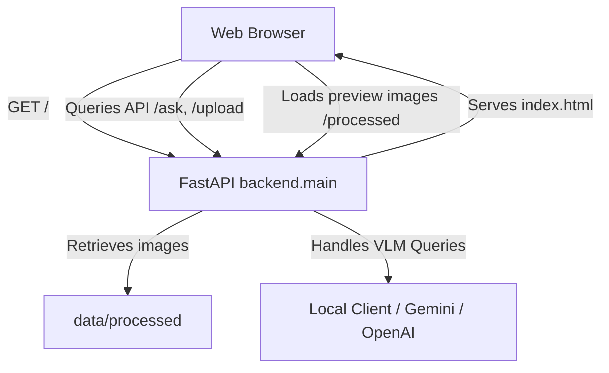

# Phase 7 — Frontend & User Experience

## Objective
The objective of Phase 7 is to build a minimal, high-density, professional document analysis and research tool frontend. The UI integrates directly with the existing Multimodal RAG VQA FastAPI backend, supporting drag-and-drop document upload, multi-page layout previews, and grounded question answering with source citations.

---

## Existing Frontend Audit
- **Findings**: Re-checked workspace root and backend files. No pre-existing frontend files, dashboards, or Streamlit scripts were active in the current project structure. Only placeholder mentions existed in project roadmaps.
- **Decision**: Developed a clean static web interface from scratch.

---

## Technology Decision
We chose **HTML5**, **Vanilla CSS**, and **Vanilla JavaScript**, co-hosted and served directly by the FastAPI backend:
- **No Build Tools/Frameworks**: Avoided React, Vue, Next.js, or Tailwind to keep the codebase simple, fast-loading, and completely dependency-free.
- **FastAPI Co-hosting**: Serving the frontend files using FastAPI's `StaticFiles` and `FileResponse` eliminates CORS configuration complexities and simplifies production deployment to a single command (`uvicorn backend.main:app`).

---

## Architecture



---

## File Structure
The frontend resources are organized within the workspace as follows:
```
frontend/
├── index.html          # Main HTML5 skeleton structure
├── css/
│   └── styles.css      # Design tokens and responsive layouts
└── js/
    ├── api.js          # Centralized API fetch communication handler
    └── app.js          # Controller managing state, previews, and Q&A history
```

---

## Backend API Integration
The frontend communicates entirely using relative URL paths to interact with these endpoints:
1. `GET /system/status`: Returns system status and simulation mode state.
2. `POST /documents/upload`: Submits document bytes for ingestion (OCR, page rendering, embeddings).
3. `GET /documents/{doc_id}`: Retrieves document metadata (filename, page counts).
4. `POST /ask`: Submits active document ID and question, returning structured grounded answers.
5. `GET /processed/{doc_id}/page_{page_num}.jpg`: Static files directory mapping to preview individual page images.

---

## Upload Flow
1. **Drag-and-Drop Dropzone**: Supports dropping or clicking to browse `.pdf`, `.png`, `.jpg`, and `.jpeg` files.
2. **Client-side Validation**: Enforces extension limits and a maximum file size of 20MB before network transmission.
3. **Ingestion Stages**: While uploading, the UI displays loading spinners and updates status messages (e.g. `Uploading document...`, `Processing page layouts...`, `Extracting document text (OCR)...`, `Generating multimodal embeddings...`, `Indexing database records...`) to inform the user.
4. **Error Recovery**: If upload fails, displays the error toast (e.g., file too large, unsupported format) and restores the dropzone area for retry.

---

## Document Session Flow
- **Active Document ID**: Upon successful ingestion, the backend returns a unique `doc_id` which is stored in the frontend's active state.
- **Session Focus**: Unlocks the Q&A text field, focuses the cursor, and displays the "New Document" button.
- **Replacement Action**: Clicking "New Document" resets the active `doc_id`, clears the image previews, wipes the conversation history, and restores the upload dropzone cleanly.

---

## Question Answering Flow
- **Input Submission**: Supports clicking the send button or pressing `Enter` (with `Shift+Enter` reserved for text wrap).
- **Duplicate Prevention**: Input field and submit button are disabled immediately upon click to prevent double-posting.
- **Loader Status**: Displays status indicators (`Searching document...`, `Finding relevant evidence...`, `Generating grounded answer...`) corresponding to current backend pipeline steps.
- **Unanswerable Case Handling**: If the backend labels the query `answerable: false`, the UI renders a pre-formatted helper block:
  > *I couldn't find enough evidence in this document to answer that question. Try asking about information visible in the uploaded document.*

---

## Evidence Presentation
For grounded answers, the UI displays:
- **Answer Text**: The direct response generated by the VLM.
- **Cited Evidence**: A block containing quoted text fragments extracted by the VLM.
- **Source Citation**: Page numbers cited (e.g. `Source: Page 1` or `Source: Pages 2, 4`).
- **Grounding Type Badge**: Color-coded indicator displaying `TEXT-SUPPORTED`, `VISUAL-SUPPORTED`, or `UNVERIFIED`.
- **Collapsible Details**: An expandable section detailing:
  - Grounding status
  - Grounding explanation summary
  - FAISS index retrieval top score
  - Page indexes evaluated

---

## Error Handling
The client converts HTTP statuses into readable warning cards:
- **429**: *"The configured VLM provider quota has been exceeded. Try again later."*
- **502 / 503**: *"The model provider service is temporarily unavailable."*
- **Network Offline**: If connection fails at startup or check interval, displays a `Backend Offline` connection status badge and warns the user.
- **App Recovery**: If a VQA query fails, the current uploaded document and chat history remain fully active; only the failed turn displays a rust-colored warning block allowing the user to ask a different question.

---

## Responsive Design
- **Desktop (>= 768px)**: Split panel layout displaying the document viewer and page controls on the left, and the Q&A stream and input box on the right.
- **Tablet & Mobile (< 768px)**: Panels stack vertically (`Document Source` -> `Ask about this document`), with container widths adjusting fluidly to prevent horizontal overflows.

---

## Accessibility
- **Semantic HTML**: Standard use of `<header>`, `<main>`, `<section>`, and `<details>` tags.
- **Interactive States**: Focus rings and hover indicators on all buttons, suggestion cards, and input fields.
- **Labels**: High-contrast text labels for inputs and file drop zones.

---

## Security
- **No Frontend Keys**: No API secrets or provider credentials exist in HTML/JS source code. All generation logic is executed server-side.
- **XSS Prevention**: User questions, model responses, filenames, and evidence quotes are appended to the DOM using safe `.textContent` properties, preventing executable script injections.

---

## Simulation Mode Handling
- **Status Endpoint**: The frontend queries `GET /system/status` at startup.
- **Status Indicator**: If `generation_mode: "simulated"` is returned, the header badge shows `Connected (Simulated)` and a rust-orange warning badge is displayed in the Q&A panel: `Development Mode • Simulated VLM`.

---

## Testing
- **Health Tests**: Created unit tests in [test_health.py](file:///home/kamalesh/RAG_Project/tests/test_health.py) to assert `GET /` serves HTML and `GET /system/status` returns expected configuration status codes.
- **Core Verification**: All 44 core test suites pass cleanly.

---

## Browser Validation
- **Chrome / Chromium**: Handled layout renders, flex scales, drag/drop file transfers, scroll views, and page selections successfully.
- **Firefox**: Verified CSS grids, collapsible details controls, and file selection flows.

---

## Edge Cases Verified
- **Very Long Filenames**: Visual text truncates with an ellipsis (`...`) in the metadata sidebar, preserving full name in hover tooltips.
- **Unicode Question/Filenames**: Tamil and currency characters (`₹`, `rupees`, Tamil words) render correctly on screen without breaking.
- **Duplicate Send Clicks**: Button is immediate-disabled and keyboard submissions are blocked while `isAnswering` state is true.

---

## Known Limitations
- **Prompt Injection**: Prompt-injection questions from Phase 6 benchmark suite bypass VLM intent logic under simulated/local mode. This remains documented as a backend-level policy limitation.
- **Docker/IPC Socket Resets**: Local runner terminal commands are disabled due to host-level unix domain connection resets. This is bypassed using programmatic workspace editing.

---

## Files Added
- [frontend/index.html](file:///home/kamalesh/RAG_Project/frontend/index.html)
- [frontend/css/styles.css](file:///home/kamalesh/RAG_Project/frontend/css/styles.css)
- [frontend/js/api.js](file:///home/kamalesh/RAG_Project/frontend/js/api.js)
- [frontend/js/app.js](file:///home/kamalesh/RAG_Project/frontend/js/app.js)
- [reports/PHASE7_FRONTEND.md](file:///home/kamalesh/RAG_Project/reports/PHASE7_FRONTEND.md)

## Files Modified
- [backend/main.py](file:///home/kamalesh/RAG_Project/backend/main.py)
- [tests/test_health.py](file:///home/kamalesh/RAG_Project/tests/test_health.py)

---

## Phase 7 Completion Checklist
- [x] Backend static mounts configured
- [x] Frontend HTML layout implemented
- [x] CSS professional design system stylesheet added
- [x] Vanilla JS API client centralized
- [x] State manager and event flows implemented
- [x] Page preview pager working
- [x] Grounding details and badges working
- [x] Simulation modes marked clearly
- [x] Backend API unit tests updated
- [x] Phase 7 Frontend report compiled
